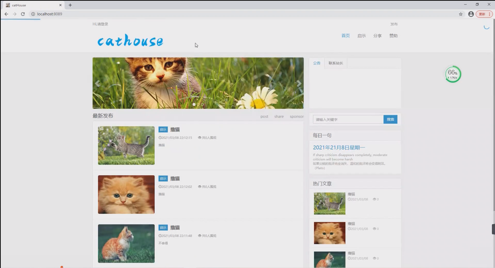
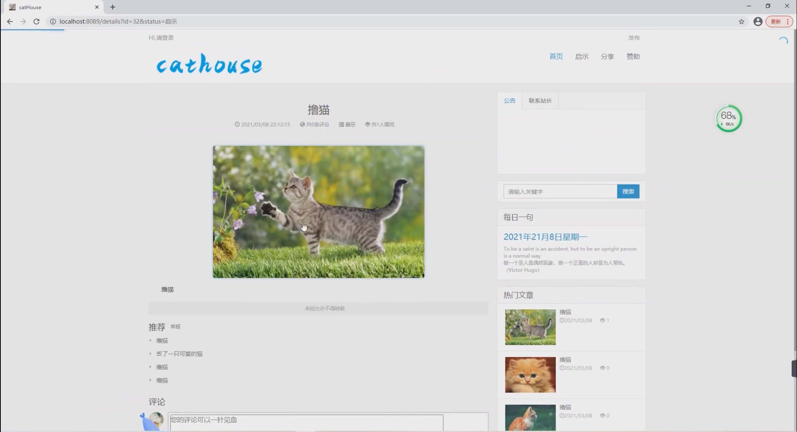
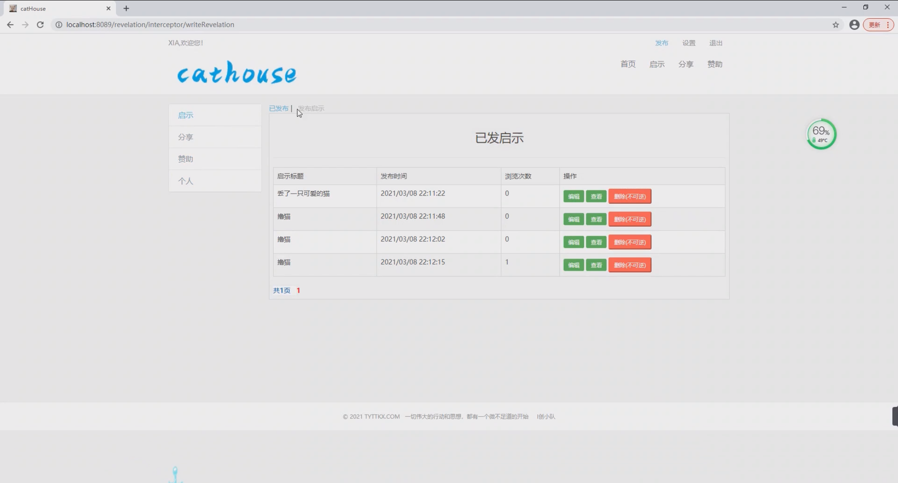
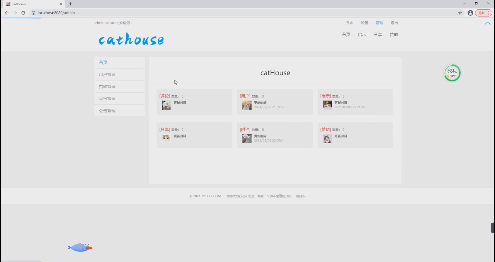
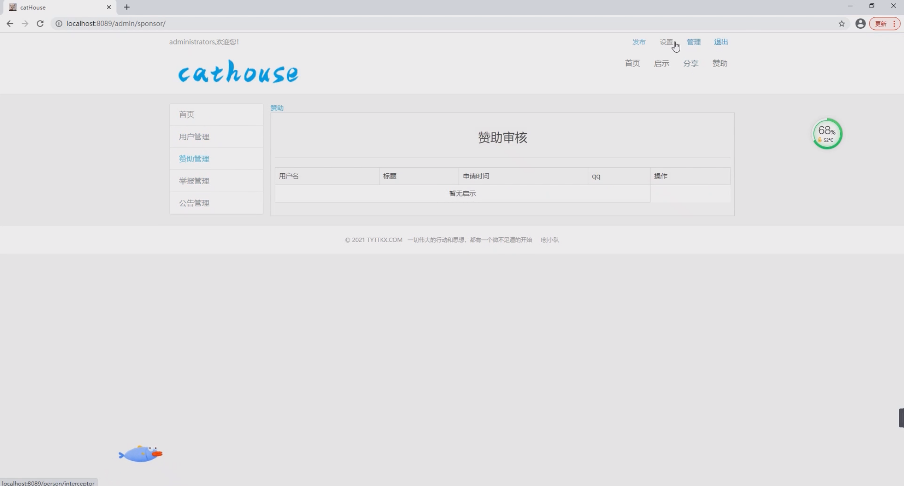

## 基于Springboot的流浪猫救助系统

###  获取sql数据库文件: 从戎源码网 (https://armycodes.com/) QQ: 386869957 QQ群: 377586148
###  所有系统地址: (https://github.com/YuLin-Coder/AllProjectCatalog) 
###  所有项目以及源代码本人均调试运行无问题 可支持远程安装部署调试、定制修改、代码讲解

## 项目介绍
基于Springboot的流浪猫救助系统，包含两种角色：管理员、用户,系统分为前台和后台两大模块，主要功能如下。

### 【管理员】:
1. 管理：管理员可以管理流浪猫救助系统的首页内容，包括发布、编辑、删除等操作。
2. 用户管理：管理员可以管理系统的用户信息，包括查看、编辑、删除等操作。
3. 赞助管理：管理员可以管理系统的赞助信息，包括查看、编辑、删除等操作。
4. 举报管理：管理员可以管理用户对不良信息的举报，包括查看、处理、删除等操作。
5. 公告管理：管理员可以发布系统公告，向用户传达重要信息。

### 【用户】:
1. 发布：用户可以发布流浪猫的信息，包括照片、地点、情况等，以寻求帮助和救助。
2. 启示：用户可以发布启示广告，帮助寻找流浪猫的主人或寻找有意领养的人。
3. 分享：用户可以分享自己救助流浪猫的经历和方法，为其他用户提供参考。
4. 赞助：用户可以向流浪猫救助组织提供赞助，支持他们救助和照顾流浪猫。
5. 个人：用户可以管理自己的个人信息，包括查看、编辑、删除等操作。

## 项目技术
- 编程语言：Java
- 数据库：MySQL
- 项目管理工具：Maven
- 前端技术：HTML、Jquery、Bootstrap、Ajax、PageHelper
- 后端技术：Spring、SpringMVC、MyBatis

## 运行环境
- JDK版本：JDK1.8及以上
- 开发工具：IDEA、Ecplise、Myecplise都可以
- 数据库: MySQL5.7及以上
- Maven：maven3.0及以上

## 运行截图

